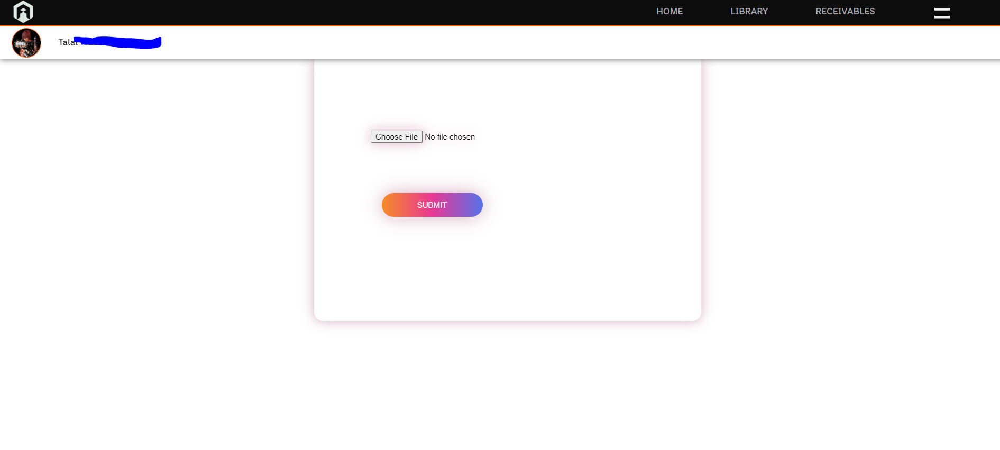

# University Library Management System

## Overview

This project is a web-based University Library Management System developed using **PHP**, **JavaScript**, **HTML**, and **CSS**. It allows users to borrow and return books, manage their profiles, and handle late return fines with a robust system that generates invoices via a PDF API. Users are charged 10 dinars per day for late returns, but can avoid fines by returning books before the due date.

## Features

- User authentication and management
- Borrow and return books
- Late return fine system (10 dinars per day)
- Dynamic due date tracking
- Invoice generation for paid fines (PDF API)
- Profile picture modification
- Responsive design

## Technology Stack

- **Backend**: PHP
- **Frontend**: HTML, CSS, JavaScript
- **Database**: MySQL (or your database of choice)
- **PDF API**: [Specify the PDF API you used]

## Screenshots

### Home Page

### Home Page

### Library Book Page

### Return Book & Fines Page

### Invoice Example

### Profile Picture Update

## Installation

1. Clone this repository: `git clone https://github.com/yourusername/library-management-system.git`
2. Navigate to the project directory: `cd library-management-system`
3. Set up your database and update the database configuration in `config.php`.
4. Install dependencies (if any) and set up your server.
5. Launch the website on your local server.

## Usage

- Register or log in as a user.
- Browse available books, borrow and return them.
- Pay any late return fines, and an invoice will be generated and stored.
- Modify your profile, including uploading a profile picture.

## License

8tuso :3
## Contact

For any questions or suggestions, feel free to reach out to me at Talal.alhayek@Outlook.com .

